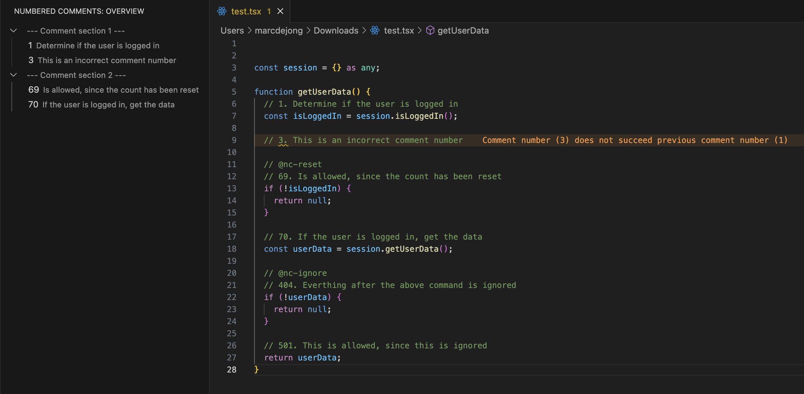

# Numbered comments

Numbering comments can improve the readability of the code and the flow of it. This extension aims to create a clear overview of these comments and aid the developer in adding and maintaining these.

**Features:**

* Shows the nested numbered comments in the sidebar for a clear overview

* Warns the developer if the numbering of the comments is inconsistant

Sidenote: Works even better with the [Error Lens](https://marketplace.visualstudio.com/items?itemName=usernamehw.errorlens) extension

**Operators**

To influence the working of this extension two operators have been added. These can be triggered by adding a comment:

1. `@nc-ignore` - Ignores anything after it, will not check and display numberd comments in sidebar
2. `@nc-reset` - Reset the current number flow and create a new comment section in the sidebar

Example:

**Feature requests / bug reports**

If you'd like a new feature or there is something wrong with the current implementation, please create an issue on: [Github](https://github.com/Marcdj-02/numbered-comments/issues)

**Enjoy!**